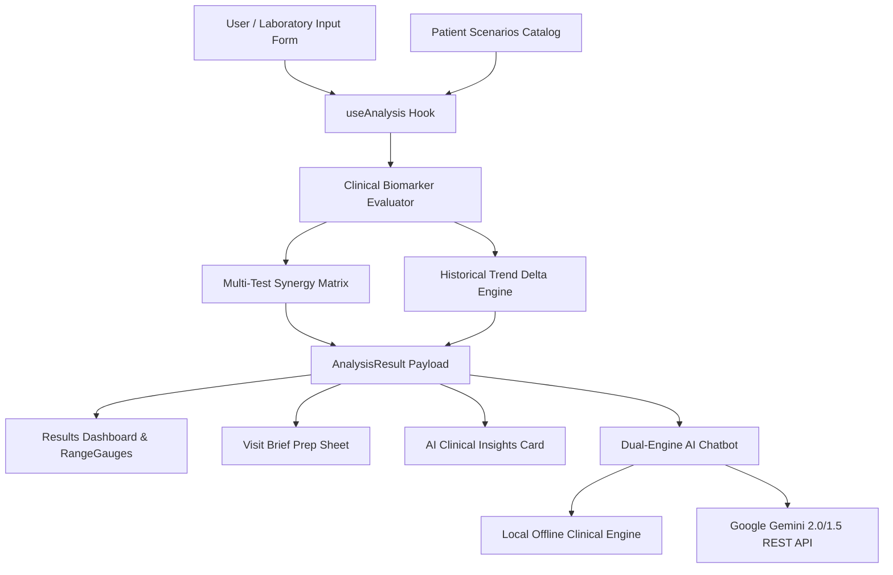

# MedExplain AI — System Architecture & Data Flow

This document provides a technical specification of the software architecture, privacy principles, state management, and lifecycle of MedExplain AI.

---

## 1. High-Level Architecture Overview

MedExplain AI is built with **React 18 + TypeScript + Vite**, engineered around a strict **zero-backend, client-side execution model**.



---

## 2. Core Architectural Pillars

### A. Zero-Backend Privacy (100% Client-Side)
- All evaluations, reference-range normalizations, cross-test combinations, and trend comparisons execute in the user's browser runtime.
- No medical test data, patient names, or lab values are transmitted to or stored on any central server or database.
- Browser storage (`localStorage`) is strictly optional and can be toggled on/off or cleared with 1 click.

### B. Dual-Engine Intelligence
- **Offline Clinical Reasoning Engine**: Instant, zero-latency deterministic generator answering questions about biomarkers, combinations, diet, and doctor prep without internet.
- **Google Gemini REST Engine**: Optional direct browser-to-Google REST integration featuring dynamic model discovery (`gemini-2.0-flash`, `gemini-1.5-flash`, `gemini-pro`).

---

## 3. Directory Layout & Organization

```
blood-test-app/
├── docs/                             # GitHub Pages Documentation Suite
│   ├── index.html                    # Interactive Docs Portal
│   ├── assets/                       # CSS & JS for documentation
│   ├── ARCHITECTURE.md               # System Architecture (This file)
│   ├── CLINICAL_ENGINE.md            # Clinical Rules & Biomarker Spec
│   ├── AI_AND_CHATBOT.md             # Dual-Engine AI Integration
│   ├── COMPONENTS_AND_HOOKS.md       # Component hierarchy & Hooks
│   └── DEPLOYMENT.md                 # Docker, Render & Cloud deployment
├── src/
│   ├── components/                   # React UI Components
│   │   ├── Chatbot/                  # Chatbot Drawer & Floating Launcher
│   │   ├── AiInsightsCard.tsx        # AI Narrative Clinical Card
│   │   ├── CrossTestCard.tsx         # Multi-Biomarker Synergy Card
│   │   ├── RangeGauge.tsx            # Visual LTR Coordinate Range Gauge
│   │   ├── ResultCard.tsx            # Expandable Biomarker Card
│   │   └── ...
│   ├── data/
│   │   ├── biomarkers.ts             # 24 Biomarker specifications & ranges
│   │   ├── rules.ts                  # Multi-test cross-analysis rules
│   │   └── scenarios.ts              # 12 Patient Clinical Scenarios
│   ├── hooks/
│   │   ├── useAnalysis.ts            # Clinical evaluation coordinator
│   │   ├── useLocalHistory.ts        # Browser history management
│   │   └── useTheme.ts               # Light / Dark theme switcher
│   ├── lib/
│   │   ├── ai/                       # AI context builders & Gemini client
│   │   └── evaluation/               # Clinical evaluators & trends
│   ├── pages/                        # Home, Scenarios, Results, VisitBrief, About
│   └── types/                        # TypeScript type definitions
```

